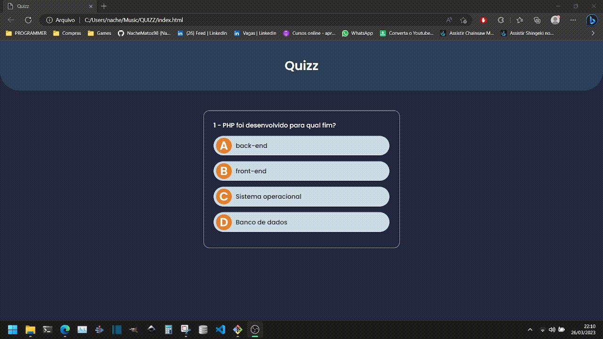

# Projeto - Quiz

Uma aplicação feita durante o curso de JavaScript, ministrado pelo instrutor Matheus Battisti. Uma quiz ou um jogo de perguntas e respostas, feita apenas com JavaScript puro, HTML e CSS.

- Tela de pergunta do Quiz

 

- Tela de resultado

 

- Demonstração

 

## 💻 Tecnologias utilizadas
As seguintes ferramentas foram utilizadas na construção do projeto:
- [Javascript](https://developer.mozilla.org/en-US/docs/Web/JavaScript) | [HTML](https://developer.mozilla.org/en-US/docs/Web/HTML) | [CSS](https://developer.mozilla.org/en-US/docs/Web/CSS)
